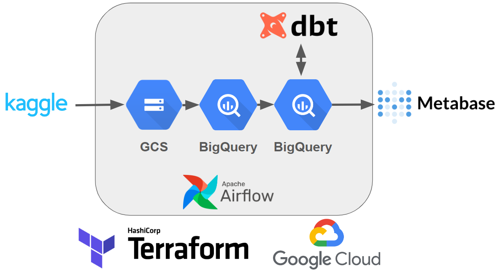
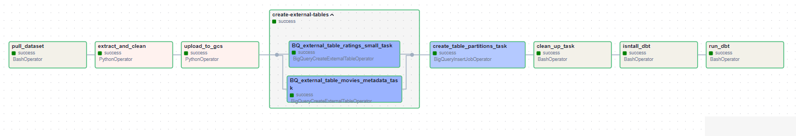
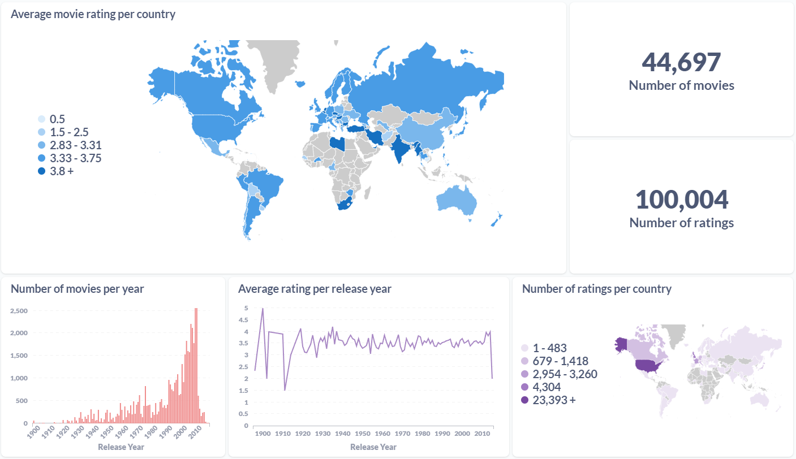

# The Kaggle's Movies Dataset Data Engineering Project
## Description
This project implements a data pipeline focusing on automatic pipeline creation using a fairly small and simple dataset.

The pipeline includes the following steps:

- Pulling the movies dataset from the Kaggle API.
- Cleaning the dataset with Python.
- Storing the cleaned datasets as Parquet files.
- Uploading the files to Google Cloud Storage (GCS).
- Creating external tables in BigQuery for these datasets.
- Performing data transformation using dbt.
- Visualizing the data in Metabase.
- The entire pipeline, except for data visualization, is automated.
- The following technologies were used in this project:

Docker for providing a system-agnostic environment.
- **Airflow** for task orchestration.
- **Terraform** for cloud resource management.
- **Google Cloud Storage** as a data lake.
- **BigQuery** as a data warehouse.
- **dbt** for automatic data transformation.
- **Metabase** for data visualization.

## Architecture


## Airflow pipeline


## Data visualisation



## How to setup

You will need 
- [Google Cloud Platform Service Account]([https://cloud.google.com/](https://cloud.google.com/iam/docs/service-account-overview)) with
  - `BigQuery Admin`
  - `Storage Admin`
  - `Storage Object Admin`
  - `Viewer`
  roles.
- [kaggle API key](https://www.kaggle.com/)
- Docker Desktop
- Terraform

1. Clone the repository and navigate into it.
2. Run the following command to build and start the Docker containers:

   ```bash
   make up
   ```

3. Set up your credential files:
   - Copy `kaggle.json` into the `.kaggle` folder.
   - Copy your Google service account key JSON file into the `.google` folder. Make sure to adjust the filename in the `.env` file accordingly.
   - The `.dbt/profiles.yml` file uses the Google credential file, so adjust only your region.
   
4. Set up your environment variable `GOOGLE_APPLICATION_CREDENTIALS` to point to your Google JSON file.
5. Execute Terraform with the following commands:

   ```bash
   make tf-init
   ```
   
   ```bash
   make infra-up
   ```

6. Go to the Airflow UI (port 8080). Both the username and password are `airflow`.
7. Execute the DAG.
8. Unit test and formatting can be done with:

   ```bash
   make ci
   ```

## Credits
This project based mostly on [this](https://github.com/iamraphson/DE-2024-project-book-recommendation/tree/main) project, which in its turn is based on [Data Engineering Zoomcamp](https://github.com/DataTalksClub/data-engineering-zoomcamp) project.
